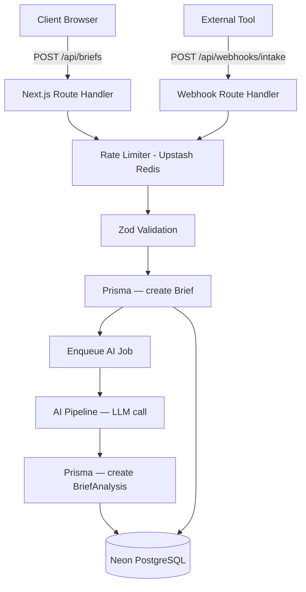

# Design Document — Veloce Module 01

## Overview

Module 01 covers the public-facing intake surface and the AI analysis pipeline. A prospective client fills out a form (or an external tool posts to a webhook), the brief is persisted to PostgreSQL, and an async AI job enriches it with structured analysis. The result is two linked database records: a raw `Brief` and a derived `BriefAnalysis`.

---

## Architecture



The entire stack runs on Next.js 14 App Router. Route handlers act as the API layer. The AI pipeline runs as an async function triggered after the brief is saved — no separate worker process is needed for free-tier deployment on Vercel (background processing via `waitUntil` or a fire-and-forget async call).

---

## Components and Interfaces

### 1. Public Intake Form (`/app/(public)/page.tsx`)

- React Client Component (interactivity required for rich text, validation, loading state).
- Rich text editor: `Tiptap` (lightweight, headless, no paid tier).
- Form state managed with `react-hook-form` + Zod resolver.
- Budget range dropdown: predefined tiers (e.g., `<$5k`, `$5k–$15k`, `$15k–$50k`, `$50k+`).
- Timeline urgency: radio/select (`ASAP`, `1–3 months`, `3–6 months`, `6+ months`).
- On submit: POST to `/api/briefs`, show loading skeleton on button, display success or error state.

### 2. Brief Submission API (`/app/api/briefs/route.ts`)

- Applies rate limiting via Upstash Redis (`@upstash/ratelimit`): 5 requests per 10 minutes per IP.
- Validates body with Zod schema.
- Creates `Brief` record in Prisma.
- Fires AI pipeline asynchronously (non-blocking).
- Returns `201` with brief ID on success; `429`, `400`, or `500` with consistent error shape on failure.

### 3. Webhook Endpoint (`/app/api/webhooks/intake/route.ts`)

- Reads raw request body for HMAC verification before JSON parsing.
- Verifies `X-Webhook-Signature` header using `HMAC-SHA256` with a shared secret from env.
- On valid signature: applies same rate limiting and Zod validation as the form submission API.
- Reuses the same `createBrief` service function — identical pipeline.
- Returns `401` for invalid/missing signature.

### 4. AI Pipeline Service (`/lib/ai/pipeline.ts`)

- Called after brief creation; runs asynchronously.
- Sends the brief description + metadata to the LLM with a structured output prompt.
- Uses `zod-to-json-schema` or a JSON mode prompt to enforce structured output.
- Parses and validates the LLM response with a Zod schema.
- Retries up to 3 times on parse failure or API error (exponential backoff).
- On final failure: creates a `BriefAnalysis` record with `status: "failed"` and logs the error.
- Provider: **Google Gemini** (free tier via `@google/generative-ai`) as default; easily swappable.

### 5. Brief Service (`/lib/briefs/service.ts`)

- `createBrief(data)` — validates, persists Brief, triggers AI pipeline.
- Shared by both the form API and webhook handler to ensure identical processing.

---

## Data Models

```prisma
model Brief {
  id              String        @id @default(cuid())
  title           String
  description     String        @db.Text
  budgetRange     BudgetRange
  timelineUrgency TimelineUrgency
  contactName     String
  contactEmail    String
  source          BriefSource   @default(FORM)
  createdAt       DateTime      @default(now())
  updatedAt       DateTime      @updatedAt

  analysis        BriefAnalysis?

  @@index([createdAt])
  @@index([source])
}

model BriefAnalysis {
  id              String          @id @default(cuid())
  briefId         String          @unique
  brief           Brief           @relation(fields: [briefId], references: [id])
  status          AnalysisStatus  @default(PENDING)
  features        Json            // string[]
  category        ProjectCategory?
  effortMin       Int?            // hours
  effortMax       Int?            // hours
  techStack       Json?           // string[]
  complexityScore Int?            // 1–5
  rawResponse     String?         @db.Text
  errorMessage    String?
  createdAt       DateTime        @default(now())
  updatedAt       DateTime        @updatedAt

  @@index([briefId])
  @@index([status])
}

enum BudgetRange {
  UNDER_5K
  BETWEEN_5K_15K
  BETWEEN_15K_50K
  OVER_50K
}

enum TimelineUrgency {
  ASAP
  ONE_TO_THREE_MONTHS
  THREE_TO_SIX_MONTHS
  SIX_PLUS_MONTHS
}

enum BriefSource {
  FORM
  WEBHOOK
}

enum AnalysisStatus {
  PENDING
  COMPLETED
  FAILED
}

enum ProjectCategory {
  WEB_APP
  MOBILE
  AI_ML
  AUTOMATION
  INTEGRATION
}
```

### Indexing Decisions

- `Brief.createdAt` — sorted list queries on the dashboard filter by date.
- `Brief.source` — filtering by submission source (form vs. webhook).
- `BriefAnalysis.briefId` — already unique but explicit index for join performance.
- `BriefAnalysis.status` — filtering pending/failed analyses for retry or monitoring.

---

## API Contract

### POST `/api/briefs`

Request body (Zod-validated):
```json
{
  "title": "string",
  "description": "string (HTML from rich text editor)",
  "budgetRange": "UNDER_5K | BETWEEN_5K_15K | BETWEEN_15K_50K | OVER_50K",
  "timelineUrgency": "ASAP | ONE_TO_THREE_MONTHS | THREE_TO_SIX_MONTHS | SIX_PLUS_MONTHS",
  "contactName": "string",
  "contactEmail": "string (email format)"
}
```

Success: `201 { "id": "clxxx..." }`

Error shape (all errors):
```json
{ "error": "string", "details": "optional array of field errors" }
```

### POST `/api/webhooks/intake`

Same body shape as above. Additional header required:
```
X-Webhook-Signature: sha256=<hmac_hex>
```

---

## Error Handling

| Scenario | Behavior |
|---|---|
| Rate limit exceeded | 429 + user-facing message |
| Zod validation failure | 400 + field-level error details |
| Invalid/missing HMAC | 401 + generic rejection message |
| DB write failure | 500 + generic error, logged server-side |
| AI API timeout/error | Retry up to 3x; mark analysis `FAILED` on exhaustion |
| LLM returns unparseable JSON | Retry with stricter prompt; mark `FAILED` after 3 attempts |

---

## Testing Strategy

- Unit tests for the Zod validation schemas (brief input, AI response shape).
- Unit tests for the HMAC verification utility.
- Unit tests for the AI pipeline parser (mock LLM responses — valid, malformed, partial).
- Integration test for `POST /api/briefs` — happy path, rate limit, validation error.
- Integration test for `POST /api/webhooks/intake` — valid signature, invalid signature, valid payload.
- Tests use `vitest` with `msw` for mocking external HTTP (LLM provider).
